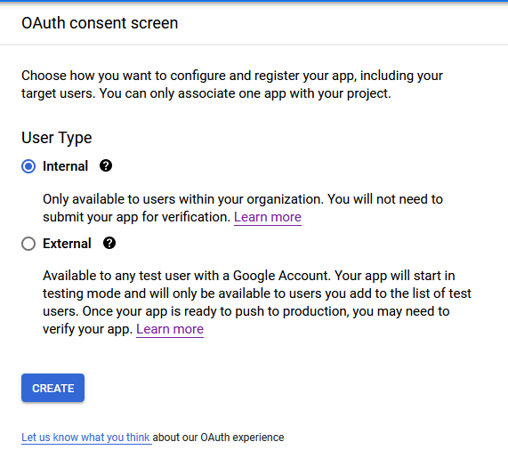
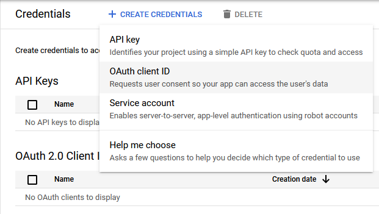
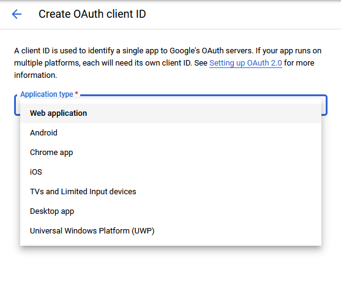
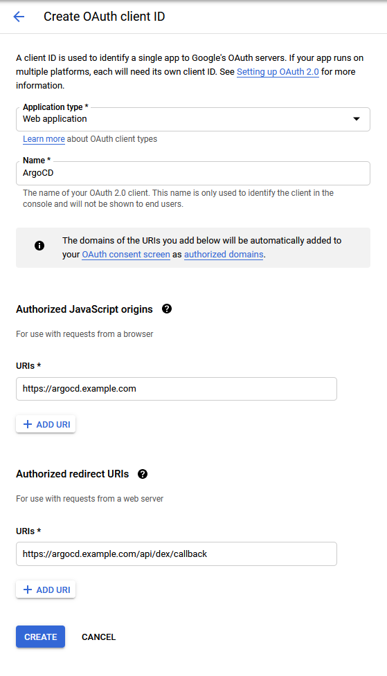
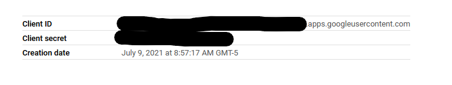

# Google

* [G Suite SAML App Auth using Dex](#g-suite-saml-app-auth-using-dex)
* [G Suite OIDC App Auth using Dex](#g-usite-oidc-app-auth-using-dex)

Once you've set up one of the above integrations, be sure to edit `argo-rbac-cm` to configure permissions (as in the example below). See [RBAC Configurations](../rbac.md) for more detailed scenarios.

```yaml
apiVersion: v1
kind: ConfigMap
metadata:
  name: argocd-rbac-cm
  namespace: argocd
data:
  policy.default: role:readonly
```

## G Suite OIDC App Auth using Dex

### Configure your OAuth Consent screen
1. In the [Google Cloud console](https://console.cloud.google.com) open the left-side menu and select `APIs & Services` > `OAuth consent screen`

  

2. Under the `User Type` select the user type you want to allow signing in, `Internal` users are internal to the organization hosting the Oauth screen and `External` is anyone with a Google Account, the Dex connector allows limiting the `External` user type to only certain organizations, once selected, click `Create` to configure your consent screen

  

3. Enter `App Name`, `User support email` and `Developer contact information` then choose `Save and Continue`

  

4. Select `Add Or Remove Scopes` and select the `.../auth/userinfo.profile` and `openid` scopes, once selected, click `Update` to save your selected scopes and click `Save and Continue` to finish configuration of your consent screen

  

### Configure your OAuth client credentials
1. In the [Google Cloud console](https://console.cloud.google.com) open the left-side menu and select `APIs & Services` > `Credentials`

  

2. Click on `Create Credentials` and select `OAuth client ID`

  

3. Click on `Application type` and select `Web application`

  

4. Fill out the `Name` of your application (eg. `ArgoCD`), `Authorized JavaScript origins` (eg. `https://argocd.example.com`) and `Authorized redirect URIs` (eg. `https://argocd.example.com/api/dex/callback`), once completed, click `Create`

  

5. Copy the `Client ID` and `Client secret` values from the popup or click on the Application name and retrieve them from the settings page, these will be used to configure your Dex connector

  

### Configure Argo to use the new Google OIDC App
Edit `argo-cm` and add the following `dex.config` to the data section, replacing the `clientID`, `argocd.example.com`, `clientSecret`, and optionally `hostedDomains` with your values from the Google OIDC App:

```yaml
data:
  url: https://argocd.example.com
  dex.config: |
    connectors:
    - type: google
      id: google
      name: Google
      config:
        clientID: client-id.apps.googleusercontent.com
        clientSecret: client-secret
        issuer: https://accounts.google.com
        redirectURI: https://argocd.example.com/api/dex/callback
        hostedDomains:
        - example.com
```

The `hostedDomains` property is used to limit the organizations that are allowed to login to ArgoCD

### Using GSuite Groups for RBAC in ArgoCD

The default Dex connector allows users to sign in with their email address, however, if you manage a `GSuite` organization and want to configure your RBAC based on `GSuite` groups follow [this guide](https://dexidp.io/docs/connectors/google/) from Dex to configure a Google Cloud service account with `Domain-Wide delegation`

Once the service account has been configured, add the following property to `argocd-rbac-cm` so that ArgoCD uses the groups OIDC claim for RBAC

```yaml
  scopes: '[email, groups]'
```

## G Suite SAML App Auth using Dex

### Configure a new SAML App

1. In the [Google admin console](https://admin.google.com), open the left-side menu and select `Apps` > `SAML Apps`

    

2. Under `Add App` select `Add custom SAML app`

    

3. Enter a `Name` for the application (eg. `Argo CD`), then choose `Continue`

    

4. Download the metadata or copy the `SSO URL`, `Certificate`, and optionally `Entity ID` from the identity provider details for use in the next section. Choose `continue`.
    - Base64 encode the contents of the certificate file, for example:
    - `$ cat ArgoCD.cer | base64`
    - *Keep a copy of the encoded output to be used in the next section.*
    - *Ensure that the certificate is in PEM format before base64 encoding*

    

5. For both the `ACS URL` and `Entity ID`, use your Argo Dex Callback URL, for example: `https://argocd.example.com/api/dex/callback`

    

6. Add SAML Attribute Mapping, Map `Primary email` to `name` and `Primary Email` to `email`. and click `ADD MAPPING` button.

    

7. Finish creating the application.

### Configure Argo to use the new Google SAML App

Edit `argo-cm` and add the following `dex.config` to the data section, replacing the `caData`, `argocd.example.com`, `sso-url`, and optionally `google-entity-id` with your values from the Google SAML App:

```yaml
data:
  url: https://argocd.example.com
  dex.config: |
    connectors:
    - type: saml
      id: saml
      name: saml
      config:
        ssoURL: https://sso-url (eg. https://accounts.google.com/o/saml2/idp?idpid=Abcde0)
        entityIssuer: https://argocd.example.com/api/dex/callback
        caData: |
          BASE64-ENCODED-CERTIFICATE-DATA
        redirectURI: https://argocd.example.com/api/dex/callback
        usernameAttr: name
        emailAttr: email
        # optional
        ssoIssuer: https://google-entity-id (e.g. https://accounts.google.com/o/saml2?idpid=Abcde0)
```

### References

- [Google Cloud OAuth Consent Screen](https://support.google.com/cloud/answer/10311615?hl=en)
- [Google Cloud OAuth 2.0 Client](https://support.google.com/cloud/answer/6158849?hl=en)
- [Dex Google OIDC connector docs](https://dexidp.io/docs/connectors/google/)
- [Dex SAML connector docs](https://dexidp.io/docs/connectors/saml/)
- [Google's SAML error messages](https://support.google.com/a/answer/6301076?hl=en)
